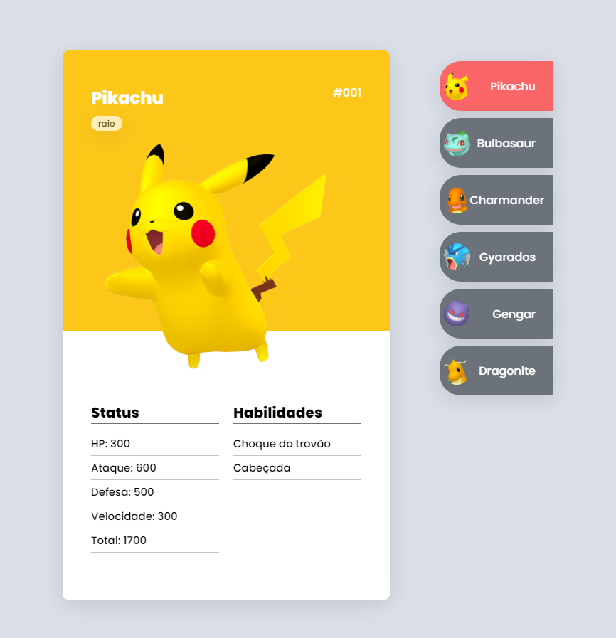
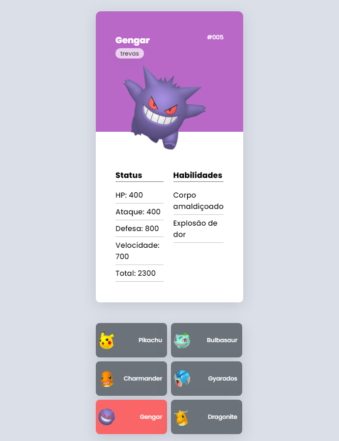

# Pokédex
projeto feito com html, css e javascript, site simple e responsivo click na lista para ver os pokemons

OBS: números dos status inventados

site para teste: https://davidrherinson.github.io/pokedex/

 

